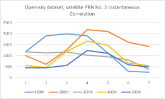

# GNSS Software-Defined Receiver (SDR) Signals Processing Study - Technical Report

Author: Lo Long Yin 

Student ID: 21119189r
# Background
This study aims to review the theory of GNSS receivers by analyzing two real Intermediate Frequency (IF) datasets collected in open-sky and urban environments, respectively. Starting from the datasets collected by the ADCs of the front-end, the GNSS decoding process includes four major steps: acquisition, tracking, navigation data decoding, and PVT estimation. The process and results of each major step are reported in separate sections. Furthermore, an additional section details the application of Kalman filter-based positioning for improved PVT estimation. A brief conclusion is provided in the last section to summarize the findings of this study.
# Acknowledgement
**The following results are obtained using the open-source MATLAB code for a Vector Tracking-based GPS Software-Defined Receiver (GPSSDR-vt) developed by Prof. B. Xu and colleagues. The code is available at [https://beta.ngs.noaa.gov/gps-toolbox/GPS_VT_SDR.htm**](https://beta.ngs.noaa.gov/gps-toolbox/GPS_VT_SDR.htm)**

**The open-access ionospheric and tropospheric delay correction factors are provided by the Hong Kong Government Land Department, accessible at [https://www.geodetic.gov.hk/en/satref/satref.htm**](https://www.geodetic.gov.hk/en/satref/satref.htm)**
# Acquisition
Acquisition is the first step in GNSS signal processing. The main function of acquisition is to detect visible satellites and determine the coarse values of their carrier code phase and Doppler frequency. The acquisition process uses a short period of data (i.e., a few milliseconds) to search for the possible code phase-Doppler frequency combinations that match the C/A code of the target satellites.

GPSSDR-vt uses the parallel code phase search algorithm for acquisition. The concept of this algorithm is to apply FFT to perform a circular correlation of the incoming signal and the replica. This algorithm computes the possible code phases in parallel, which significantly improves processing time compared to the brute-force search. Additionally, this software uses a two-step coarse-to-fine acquisition method to acquire more accurate code phase and Doppler frequency values.

As the algorithm has been implemented in GPSSDR-vt, inputting the correct parameters according to the specifications of the satellite and front-end is key. According to the provided dataset information, both datasets collect L1 frequency bands (1575.42 MHz) and use an 8-bit I/Q data format. The two datasets are collected from different front-ends: the open-sky dataset is collected from a low-IF front-end with a 4.58 MHz intermediate frequency and a 58 MHz sampling frequency, while the urban dataset is collected from a zero-IF front-end with a 26 MHz sampling frequency.

The SNR threshold was set at 17 dB. The following satellites were detected from the datasets:

` `**Open-sky:**

|Satellite PRN No.|Code Phase (sample/58000)|Coarse Doppler Frequency (Hz)|SNR (dB)|
| - | - | - | - |
|3|3683|990|18\.095|
|4|12701|-3095|17\.293|
|16|26051|-305|26\.434|
|22|2610|1565|19\.832|
|26|57908|1835|27\.205|
|27|49778|-3225|22\.720|
|31|39064|1045|24\.401|
|32|20170|3345|22\.198|

**Urban:**

|Satellite PRN No.|Code Phase(sample/26000)|Doppler Frequency (Hz)|SNR (dB)|
| - | - | - | - |
|1|22742|1200|42\.634|
|3|1154|4285|29\.377|
|7|10811|365|19\.902|
|11|24851|405|23\.052|
|18|15362|-365|18\.694|
|22|2050|3315|17\.792|

**The raw data in this section is located at “Soucre/1Acquisition”.**
# Tracking
Acquisition is the first step in GNSS signal processing. The main function of acquisition is to detect visible satellites and determine the coarse values of their carrier code phase and Doppler frequency. The acquisition process uses a short period of data.

The tracking process uses the initial coarse code phase and Doppler frequency to maintain long-term correlation, in order to accurately extract digital navigation data for subsequent procedures. The conventional approach uses a Delay Lock Loop (DLL) and a Phase Lock Loop (PLL) to track and correct the carrier phase.

GPSSDR-vt employs the normalized noncoherent early-minus-late envelope discriminator, *0.5×(E−L)(E+L)*​, for DLL; and the two-quadrant arctangent phase discriminator, *atan(Pq/Pi)/2π*​, for PLL.

The early-prompt-late correlator spacing in the software is 0.5 chips, which is the typical value. In this study, the code was modified to include additional early and late correlators at 0.25 and 0.75 chips earlier and later, respectively, to evaluate the tracking performance. The following diagrams take satellite PRN No. 3 as an example, plotting the instantaneous and continuous correlation functions.

Instantaneous correlation function diagrams

Continuous correlation function diagrams

In theory, multipath issues cause overlapping signals and distortion in the correlation pattern. The distorted pattern further interferes with the DLL algorithm, preventing the prompt correlator from aligning with the signal in the "Early=Late" condition. However, the study dataset did not illustrate this factor. The instantaneous correlation function diagrams show a distorted pattern in the open-sky dataset. In contrast, the urban dataset correlation plot is an ideal triangle with a 5-10 times higher average correlation. Although this report captures only a small fraction of samples, this observation is a common phenomenon in the dataset. This phenomenon may be related to differences in the front-end.

**The raw data and revised code in this section is located at “Soucre/2Tracking”.**

# Navigation data decoding
The tracking process provides the digital signal for decoding. The next step is to decode the navigation message and extract key parameters, such as ephemeris data. The message is encoded by the satellite and packed into a 1500-bit-long frame, with each frame containing 5 subframes. Identifying the start of a subframe is necessary before determining the meaning of the bits; this process is called frame synchronization. The first 8 bits of each subframe serve as the preamble for frame synchronization. The start of a subframe can be found by comparing the preamble pattern.

Each subframe also contains a 17-bit truncated version of the time of week (TOW), which counts starting from midnight between Saturday and Sunday in UTC. The TOW is the satellite clock time reference for pseudorange estimation in positioning. Another key message is the ephemeris parameters, contained in the second and third subframes. The ephemeris provides all necessary data to calculate the satellite's current location for pseudorange estimation in positioning.

The key parameters are extracted from the datasets. Since the navigation data rate is 50 Hz and the duration of the datasets is 90 seconds, 3 frames (or fewer), and 15 subframes (or fewer) are collected. The following table uses satellites detected in both datasets, satellite PRN No. 3 and No. 22, as examples, listing the first acquired time and ephemeris parameters. (Minor parameters provided by the ephemeris message, such as correction factors and drift, are not listed in the results.)

||PRN No. 3 (Urban, 2019)|PRN No. 3  (Open sky, 2021)|PRN No. 22 (Urban, 2019)|PRN No. 22 (Open sky, 2021)|
| - | - | - | - | - |
|TOW (s)|449370|390120|449370|390120|
|toe|453600|396000|453600|396000|
|√a|5\.153e+03|5\.153e+03|5\.153e+03|5\.153e+03|
|e|0\.00222|0\.00388|0\.00721|0\.00671|
|Mo|-0.430|2\.746|1\.857|-1.260|
|w|0\.594|0\.999|-1.333|-0.887|
|io|0\.962|0\.970|0\.927|0\.936|
|W0|-2.064|1\.377|-2.137|1\.272|
|Dn|4\.447e-09|4\.401e-09|5\.191e-09|5\.283e-09|
|Dot i|4\.810e-10|-1.300e-10|4\.293e-10|3\.214e-11|
|Dot W|-7.832e-09|-8.041e-09|-8.103e-09|-8.668e-09|

For the satellite messages acquired from the same dataset, the time information is identical. According to the TOW and its conversion to day and time, the open-sky dataset was taken on Thursday at 12:22:00, and the urban dataset was taken on Friday at 4:49:30. The decoded TOWs match the provided data collection dates.

The comparison also showed changes in the satellite's orbit. The semi-major axis (<i>a</i>), eccentricity (<i>e</i>), and inclination at the reference epoch (<i>i0</i>) are stable. However, the longitude of the ascending node (<i>Ω0</i>) shifted significantly.

**The raw data in this section is located at “Soucre/3Decoding”.**

# Position and velocity estimation
However, the extra time of flight when signals pass through the ionosphere and troposphere can cause significant errors, up to 15 meters, in pseudorange estimation. Fortunately, ionospheric and tropospheric delays can be compensated for using the correct correction factors. Since these delays are related to signal frequency, dual-frequency receivers can be used to measure correction factors.

The Hong Kong Government Land Department provides historical GNSS data collected from their reference station network. This study applied the RINEX format data provided by the Land Department for the corrections.

Geographical relationship between the dataset ground truth coordinates and reference station network. (Source: The HK Land Department)

According to the dataset information, the ground truth coordinates of the open-sky and urban datasets are in Tai Hang Tung and Kowloon Bay, Hong Kong, respectively. The map of the Hong Kong satellite positioning reference station network shows that the nearest reference stations to Tai Hang Tung and Kowloon Bay are the Stonecutters Island reference station (HKSC) and the Quarry Bay integrity monitoring station (HKQT), respectively. Therefore, the correction factors from these two reference stations at the corresponding times are applied in the PVT estimation.

||Open-sky|Urban|
| - | - | - |
|ION ALPHA|1\.1176e-08|0\.6519e-08|
||0\.0000e+00|0\.2235e-07|
||-5.9605e-08|-0.5960e-07|
||0\.0000e+00|-0.1192e-06|
|ION BETA|9\.0112e+04|0\.8602e+05|
||0\.0000e+00|0\.9830e+05|
||-1.9661e+05|-0.6554e+05|
||0\.0000e+00|-0.5243e+06|

Stonecutters Island reference station and Quarry Bay integrity monitoring station. (Source: The HK Land Department)

The following diagrams takes the satellite PRN No. 3 as the example, ploted the pseudorange estimation after correction.

Pseudorange estimation

Weighted Least Squares (WLS) is the conventional algorithm used to compute the PVT from pseudorange estimations of several satellites (not fewer than four). The concept of WLS is to linearize the nonlinear pseudorange equation and solve it through iteration, which is advanced in terms of software computing. A weighting matrix is used in the iteration to account for the reliability of each satellite, which can be determined by the SNR. The iteration runs until the error is smaller than the preset threshold. GPSSDR-vt implements WLS to compute the PVT, as shown in the figure below.

Horizontal position estimation errors

Urban dataset position estimation errors in time domain

Urban dataset, horizontal position estimation errors only for data after the 300th data point

The horizontal position estimation errors show that the open-sky dataset has a precision level of around 15 meters and a bias of 25 meters. The bias might arise from satellite or receiver clock offsets or from ionospheric and tropospheric delays that are not fully eliminated by the correction factors.

The urban data has lower precision, with errors up to 100 meters. However, correlations were found in the North-East plane. From a time domain perspective, there is a trace showing the estimated position shifting to the North-West over time. Assuming the target of the urban dataset is moving while receiving signals, the precision should be evaluated using only the static data after the 300th data point. In that case, the precision would be around 40 meters, still worse than the open-sky dataset. Due to the assumption that the target is moving, there is not enough information to evaluate the bias.

In theory, the urban dataset contains multipath and non-line-of-sight (NLOS) effects, which can degrade positioning accuracy. This matches the observations from the two sets of data.

Velocity estimation results

**The raw data in this section is located at “Soucre/4Estimation”.**

# Kalman filter-based positioning
The Kalman filter is an estimator based on data fusion and state update iteration. The state update process uses physics-based state transition and control-input models. The data fusion process combines the current measurement with the previously predicted state, weighted by the Kalman gain. The Kalman gain is adjusted according to the covariances and noise levels.

The Kalman filter is only suitable for linear systems. For nonlinear systems like the pseudorange equation, the Extended Kalman Filter (EKF) is applicable. The EKF requires linearization and discretization of the original equations. GPSSDR-vt implements EKF with vector tracking to improve positioning estimation, and the results are shown in the figure below.

Horizontal position estimation errors using vector tracking EKF

Velocity estimation results using vector tracking EKF

An obvious consequence of using vector tracking EKF is the significant reduction in bias. The bias of the open-sky dataset is reduced to around six meters. However, the precision of the open-sky dataset seems to decrease to around 40 meters, whereas the precision of the urban dataset remains at around 40 meters. On the other hand, the velocity estimation using vector tracking EKF provides a much more precise estimation compared to the conventional WLS approach. 

**The raw data in this section is located at “Soucre/4Estimation”.**

# Conclusion
This study implemented acquisition, tracking, navigation data decoding, and PVT estimation in a GNSS SDR. The two datasets used in this study represented open-sky and urban environments.

The negative impacts of urban environments were observed in acquisition, tracking, and PVT estimation. Firstly, eight satellites were found in the open-sky dataset, whereas only six were found in the urban dataset during acquisition. This might be because buildings in the urban environment blocked some satellites, causing non-line-of-sight (NLOS) conditions. Secondly, multipath issues in urban environments can cause correlation pattern distortion, which interferes with the DLL algorithm in the tracking process. Thirdly, the urban dataset had relatively lower precision compared to the open-sky dataset in PVT estimation. This might be because the estimation was affected by inaccurate time-of-flight (ToF) signals due to multipath interference.

Vector tracking and EKF are the algorithems that help to relief the random noise and multipath problem. This improves PVT estimation, especially for urban environments.
# Declaration
- **The results of this study are based on limited data and might not reflect the actual situation. Further studies with larger datasets would help to better analyze the impact of the receiving environment on the quality of PVT estimation.**
- **In this study, generative AI was only used for grammar and spelling checking.**
